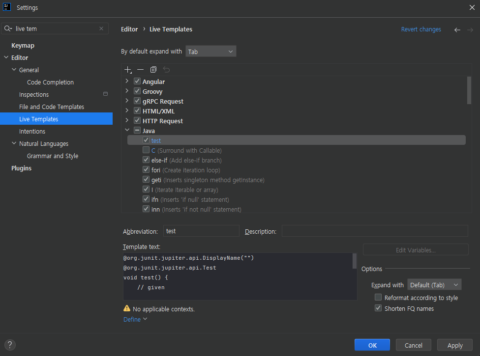

### Template 추가하기



```java

@org.junit.jupiter.api.DisplayName("")
@org.junit.jupiter.api.Test
void test() {
    // given

    // when

    // then
}
```

### 키워드 정리

- @DisplayName
    - 도메인 정책, 용어를 사용한 명확한 문장
- Given / When / Then
    - 주어진 환경, 행동, 상태 변화
- TDD vs. BDD
- JUnit vs. Spock

### 언어가 사고를 제한한다.